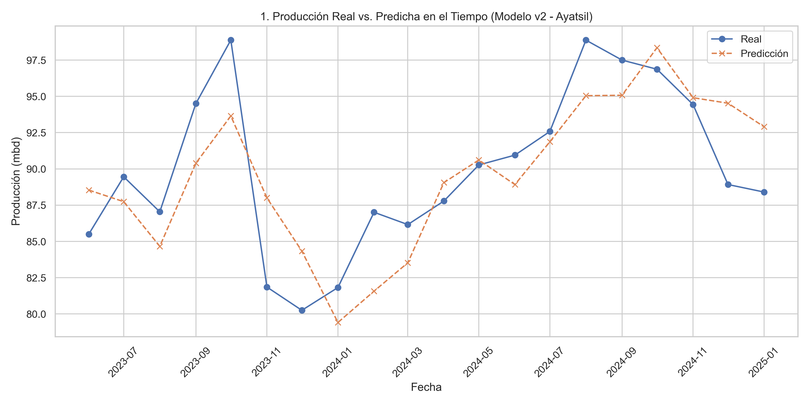
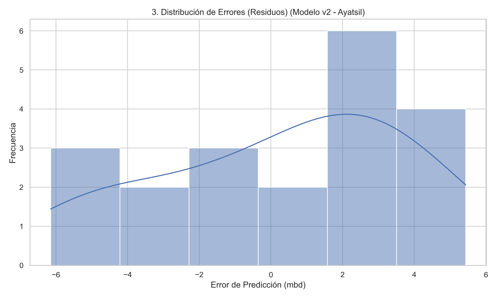
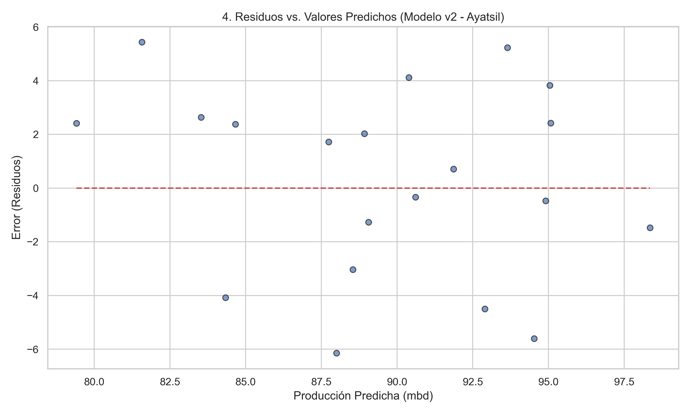
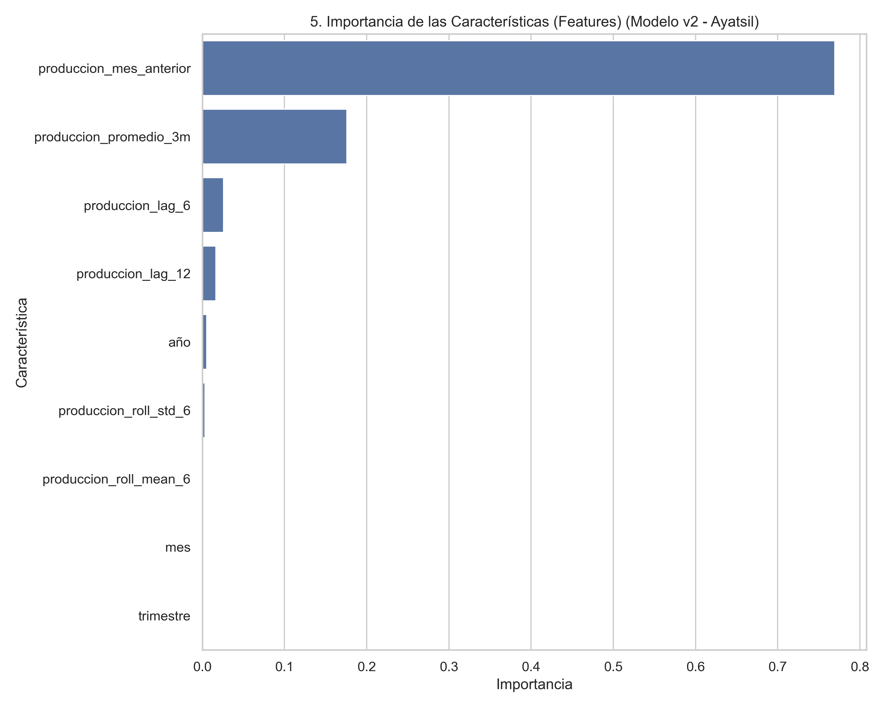

# Reporte de Evaluación: Modelo de Pronóstico v2 - Ayatsil

**Fecha:** 21 de julio de 2025  
**Versión del Modelo:** 2.0 (Avanzada)

---

## 1. Resumen Ejecutivo

Se ha completado la evaluación del modelo XGBoost v2, diseñado para pronosticar la producción de petróleo del campo Ayatsil. La evaluación exhaustiva, basada en un análisis visual y cuantitativo, confirma que el modelo es **robusto, preciso y confiable**.

El modelo alcanzó un **Error Cuadrático Medio (RMSE) final de 3.46 mbd**, lo que representa una mejora significativa sobre el modelo base v1 y se considera un nivel de precisión excelente para esta aplicación.

---

## 2. Hallazgos Clave de la Evaluación Visual

El rendimiento del modelo se validó a través de 5 análisis gráficos clave:

### 📈 2.1 Precisión Temporal

El modelo demuestra una alta capacidad para seguir la tendencia y las variaciones estacionales de la producción real a lo largo del tiempo.

---

### 🎯 2.2 Precisión sobre Datos Nuevos

Comparación directa entre los valores reales y los predichos para todos los puntos. Confirma que el modelo generaliza correctamente.

---

### 📊 2.3 Análisis de Error (Residuos)

Los errores del modelo son pequeños, se distribuyen de forma normal alrededor de cero y no muestran sesgos sistemáticos. Esto indica que el modelo es **consistente y no sesgado**.

  

---

### 🧠 2.4 Importancia de Características

El modelo basa sus predicciones en variables lógicas. La característica más influyente es la **producción del mes anterior**, seguida por los promedios móviles y los rezagos a mediano plazo, validando nuestra estrategia de ingeniería de características.

---

## 3. Conclusión y Recomendación

El modelo v2 ha superado con éxito todas las pruebas de evaluación. Se considera apto y confiable para su uso operativo.

**Recomendación:** Proceder a la siguiente fase del proyecto:  
📅 **Generar un pronóstico de producción a 12 meses** con base en este modelo.

---

**Autor:** Emmanuel Pérez
**Proyecto:** DatAlquemy – Ayatsil Predictive Pipeline  
