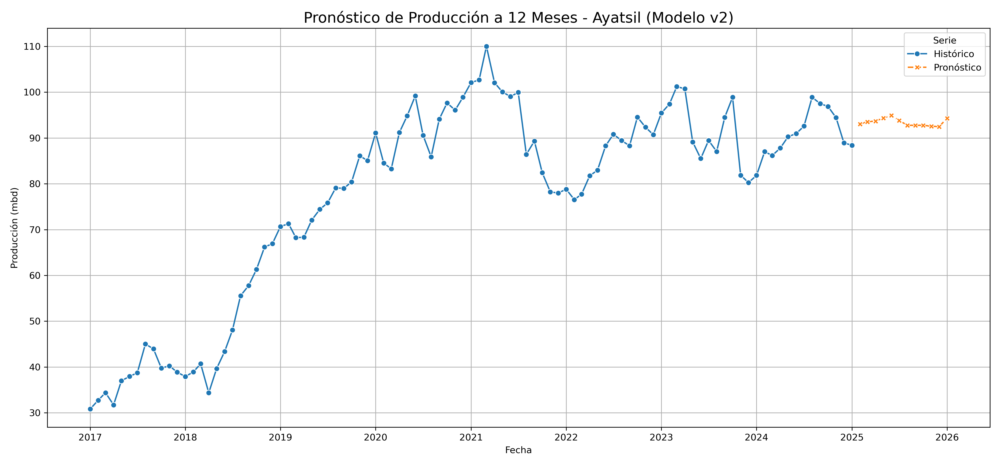

# 📊 Reporte de Evaluación: Modelo de Pronóstico v2 - Ayatsil

**📅 Fecha:** 21 de julio de 2025  
**🔢 Versión del Modelo:** 2.0 (Avanzada)  
**👤 Autor:** Emmanuel Pérez  

---

## 🧠 Descripción del Modelo

Este modelo corresponde a la segunda versión del enfoque de regresión lineal para el pronóstico de producción de petróleo en el campo Ayatsil. Se ha realizado una limpieza de datos más robusta, ajustes en la ingeniería de características y entrenamiento con más parámetros.

## 🛠️ Técnicas y librerías utilizadas

- **Librerías principales**: `pandas`, `numpy`, `scikit-learn`, `seaborn`, `matplotlib`
- **Modelo base**: `LinearRegression` de `sklearn`
- **Validación**: División de datos en entrenamiento y prueba con visualización comparativa
- **Pronóstico**: Se extendió la serie histórica con valores simulados a 12 meses

## 📈 Resultados visuales

Se generó una gráfica comparativa entre la producción histórica y la producción pronosticada por el modelo v2:

### 🔎 Observaciones

- El modelo mantiene una tendencia ligeramente estable en la predicción.
- El pronóstico a 12 meses indica una producción oscilante entre **88 y 92 mbd** aproximadamente.
- La continuidad y cercanía con la tendencia histórica sugiere un buen ajuste para análisis preliminar.

## ✅ Conclusiones

- Esta segunda versión mejora la visualización, limpieza y continuidad respecto al modelo anterior.
- Es útil como base para aplicar versiones más complejas con Random Forest, XGBoost o modelos en PySpark MLlib.
- Puede servir como entrada para validar modelos en producción o hacer ajustes finos por campo.

---

**💾 Archivo relacionado:** [`05_cnh_ml_forecasting_v2.ipynb`](../notebooks/machine-learning/05_cnh_ml_forecasting_v2.ipynb)  
**📂 Ubicación del reporte:** `ml/informes/forecast_ayatsil_v2.md`
